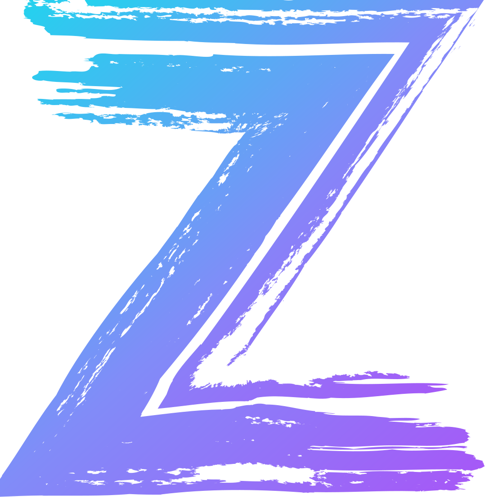

<div align="center">
  

  <p align="center">
    <b>English</b> | <a href="docs/README.fr.md">Français</a>
  </p>

  <p align="center">
    
    
    <a href="https://github.com/DevRedious/zokyva/releases/latest"></a>
    
    
    
    
  </p>

  <p align="center">
    
    
    
    
    
    
  </p>

  <p align="center">
    <i>360° Brand Uniqueness &amp; Virginity Scanner — CT Logs, DNS, Developer Registries,<br>
    Social Handles, Company Databases, and Web Archives in a single lightning-fast command.</i>
  </p>
</div>

---

##  Table of Contents
- [Why ZOKYVA?](#sec-why-zokyva)
- [The 28 Audit Points Matrix](#sec-the-28-audit-points-matrix)
- [Key Features](#sec-key-features)
- [Installation & Quickstart](#sec-installation-quickstart)
- [Usage Modes & CLI](#sec-usage-modes-cli)
- [Exports & Professional Reports](#sec-exports-reports)
- [Official Branding Kit](#sec-official-branding-kit)
- [Architecture & Performance](#sec-architecture-performance)
- [Multi-Agent Integration (Skills)](#sec-multi-agent-integration-skills)
- [License](#sec-license)

---

<a id="sec-why-zokyva"></a>
##  Why ZOKYVA?

Validating a new brand, SaaS product, or coined neologism requires far more than just checking if `.com` is available. **ZOKYVA** queries the entire technical, digital, social, and legal landscape in parallel to calculate an authoritative **360° Global Uniqueness Score (0–100%)**.

> **Strategic Guide Included**: Read [`THE-POWER-OF-NEOLOGISMS.md`](docs/THE-POWER-OF-NEOLOGISMS.md) *(or [`LE-POUVOIR-DU-NEOLOGISME.md`](docs/LE-POUVOIR-DU-NEOLOGISME.md) in French)* to understand why the world's most dominant brands (*Rolex, Google, Spotify, Sony*) are built on 100% pure coined words.

---

<a id="sec-the-28-audit-points-matrix"></a>
##  The 28 Audit Points Matrix

| Category | Targets & Checked Surfaces | Method & Source |
| :--- | :--- | :--- |
| **1. Domain Names (14 to 24 TLDs)** | `.com`, `.fr`, `.io`, `.ai`, `.dev`, `.app`, `.tech`, `.gg`, `.co`, `.net`, `.group`, `.eu`, `.org`, `.so` *(+10 in `--all` mode)* | Public SSL/TLS certificates (**Certificate Transparency** via `crt.sh`) + Direct UDP/DoH DNS resolution |
| **2. Developer Packages (5 points)** | **npm** (JS/TS), **PyPI** (Python), **Crates.io** (Rust), **GitHub** (Org/User), **GitLab** (User/Group) | Official public APIs and HTTP status inspection |
| **3. Social Media & Handles (7 points)** | **X / Twitter** (@handle), **Instagram**, **TikTok**, **YouTube**, **Telegram** (t.me), **Bluesky** (@handle.bsky.social), **Pinterest** | Fast HTTP status checks & public profile endpoints |
| **4. Company Registry (1 point)** | **French National Business Registry / RNE (INSEE / Sirene)** | Official French Government Open API |
| **5. Web History (1 point)** | **Wayback Machine (Internet Archive)** | CDX API / Archive.org historical snapshots check |
| **6. Trademark Clearance (Direct Links)** | **INPI France**, **EUIPO / TMview (Europe & Worldwide)**, **USPTO (USA)** | Dynamic generation of official clearance search queries |

---

<a id="sec-key-features"></a>
##  Key Features

- ⚡ **Ultra-Fast Multi-Threading**: Audits all 28 verification points in under 2.5 seconds via Python's native `ThreadPoolExecutor`.
- 🌐 **Built-in Bilingual Engine (i18n)**: Automatically detects system locale (English for worldwide users, French for francophone systems) with explicit `--lang en` / `--lang fr` overrides.
- 📦 **Zero External Dependencies**: 100% pure Python standard library (`urllib`, `socket`, `json`, `concurrent.futures`, `ssl`). Runs everywhere immediately.
- 🔄 **Smooth Terminal Spinner**: Real-time visual feedback while scanning.
- 💾 **Smart Local Cache (15 min TTL)**: Prevents network spam and accelerates re-audits (`~/.local/share/zokyva/cache.json`).
- 📄 **Dual Professional Export Formats**:
  - **Markdown (`.md`)**: Clean, corporate, zero-emoji, ready for GitHub docs & Notion.
  - **HTML Dark Pro (`.html`)**: Glassmorphic dark theme, multi-colored vector SVG brand icons, and one-click Print / PDF export.
- 🌐 **Standardized Web Title**: Browser tab title formatted as `ZOKYVA | BRAND | DATE`.
- 💡 **Neologism Generator (`--suggest`)**: Instantly creates and tests available `.com` brand variations using curated prefixes and suffixes.

---

<a id="sec-installation-quickstart"></a>
##  Installation & Quickstart

### Prerequisites
* Linux (Nobara, Fedora, Ubuntu, Debian, Arch...) / macOS / Windows 10 & 11 (PowerShell, CMD, WSL)
* Python 3.10 or higher

### Option A: Install Globally via Bun (Recommended & Ultra-Fast)
```bash
bun add -g https://github.com/DevRedious/zokyva
```

### Option B: Standalone One-Line Install (Curl)
```bash
curl -fsSL https://raw.githubusercontent.com/DevRedious/zokyva/main/zokyva -o ~/.local/bin/zokyva
chmod +x ~/.local/bin/zokyva
```

### Option C: Local Symlink (from source)
```bash
git clone https://github.com/DevRedious/zokyva.git
cd zokyva
chmod +x zokyva
ln -sf $(pwd)/zokyva ~/.local/bin/zokyva
```

---

<a id="sec-usage-modes-cli"></a>
##  Usage Modes & CLI

### 1. Interactive Menu (TUI)
Run `zokyva` without arguments to launch the interactive dashboard with instant search, suggestions, language switch, and cache controls:
```bash
zokyva
```

### 2. Full 360° Audit with Automatic Export (Recommended)
```bash
# Run 360° audit and generate both .md and .html reports
zokyva --deep --export <BRAND_OR_KEYWORD>

# Force English language output
zokyva --deep --export <BRAND_OR_KEYWORD> --lang en
```

### 3. Fast Domain Names Scan
```bash
# Scan 14 core TLDs (.com, .io, .ai, .dev, .app...)
zokyva <KEYWORD>

# Extended scan across 24+ TLDs (.cloud, .xyz, .studio, .agency, .digital...)
zokyva <KEYWORD> --all
```

### 4. Coined Brand Name Suggestions
```bash
zokyva --suggest <ROOT_WORD>
```
*Generates and verifies available combinations with premium prefixes (`get`, `use`, `try`, `go`...) and suffixes (`hq`, `lab`, `core`, `flow`, `tech`...).*

### 5. Machine-Readable JSON Output (for AI Agents & CI/CD)
```bash
zokyva --deep <KEYWORD> --json
```

### 6. Cache Management
```bash
zokyva --clean
```

---

<a id="sec-exports-reports"></a>
##  Exports & Reports

Generated audit dossiers are saved in `audits/`:

```text
├── audits/
│   ├── AUDIT-MARQUE-ZOKYVA-2026-08-25_20h04.html
│   └── AUDIT-MARQUE-ZOKYVA-2026-08-25_20h04.md
```

### Browser Tab Title Format (`<title>`)
```html
<title>ZOKYVA | BRAND | DATE</title>
```
*Example: `<title>ZOKYVA | ZOKYVA | 25/08/2026</title>`*

---

<a id="sec-official-branding-kit"></a>
##  Official Branding Kit

All high-fidelity vector assets are organized in [`assets/`](assets/):

###  ZOKYVA Identity Suite ([`assets/branding/`](assets/branding/))
| Variant | PNG Format | SVG Vector | Recommended Usage |
| :--- | :--- | :--- | :--- |
| **Official Cyan / Violet Gradient** | [`z-gradient.png`](assets/branding/z-gradient.png) | [`z-gradient.svg`](assets/branding/z-gradient.svg) | Official logo, README header, HTML reports |
| **Monochrome White (Dark Theme)** | [`z-white.png`](assets/branding/z-white.png) | [`z-white.svg`](assets/branding/z-white.svg) | GitHub Dark, terminal status, dark favicons |
| **Monochrome Black (Light / Print)** | [`z-black.png`](assets/branding/z-black.png) | [`z-black.svg`](assets/branding/z-black.svg) | Paper printing, light backgrounds, clean PDF |
| **Raw Vector Geometry** | — | [`z.svg`](assets/branding/z.svg) | Inline SVG integrations & custom shaders |

###  Third-Party Registry Logos ([`assets/third-party/`](assets/third-party/))
*  **PyPI** : Official isometric 3D block with blue, yellow, and lavender cubes (`assets/third-party/pypi.svg`).
*  **Crates.io** : Official 3D Rust wooden pallet cargo boxes (`assets/third-party/crates-io.png`).
*  **TikTok** : Official black note `#000000` with cyan `#26f4ee` & magenta `#fb2c53` chromatic glitch (`assets/third-party/tiktok.svg`).
*  **npm** : Official red badge `#CB3837`.
*  **GitLab** : Official tri-tone 3D Fox icon.
*  **GitHub** : Official Octocat mark.
*  **Instagram** : Official Sunset gradient.
*  **YouTube** : Official Red Play badge.
*  **Telegram** : Official Paper plane circle.
*  **Bluesky** : Official Butterfly mark.
*  **Pinterest** : Official Red P emblem.

---

<a id="sec-architecture-performance"></a>
##  Architecture & Performance

```text
zokyva/
├── zokyva                          # Standalone Python 3 CLI engine (TUI, Scanner, Exporters)
├── README.md                       # Main documentation (English)
├── README.fr.md                    # French documentation
├── LICENSE                         # MIT License
├── THE-POWER-OF-NEOLOGISMS.md      # Coined branding strategy guide (English)
├── LE-POUVOIR-DU-NEOLOGISME.md     # Coined branding strategy guide (French)
├── SKILL.md                        # Universal AI Agent skill definition
├── assets/                         # Graphic assets & visual identity
│   ├── branding/                   # ZOKYVA vector identity (SVG, PNG, Monochrome)
│   ├── icons/                      # Local Gravity UI section icons
│   └── third-party/                # Official registry logos
└── audits/                         # Exported audit dossiers (.md & .html)
```

- **XDG-Compliant Storage**:
  - Cache: `~/.local/share/zokyva/cache.json`
  - History: `~/.local/share/zokyva/history.jsonl`
  - Raw JSON Logs: `~/.local/share/zokyva/logs/`
  - User Config: `~/.local/share/zokyva/config.json`

---

<a id="sec-multi-agent-integration-skills"></a>
##  Multi-Agent Integration (Skills)

ZOKYVA comes equipped with a universal AI Agent Skill definition ([`SKILL.md`](SKILL.md)) synchronized across:
- **Antigravity / Codex**: `~/.agents/skills/zokyva/SKILL.md`
- **Claude Code / Cursor**: `~/.claude/skills/zokyva/SKILL.md`

AI agents can autonomously invoke ZOKYVA to validate brand names, product launches, or holding namespaces before making technical or legal commitments.

---

<a id="sec-license"></a>
##  License

Distributed under the **MIT License**. See [`LICENSE`](LICENSE) for details.
